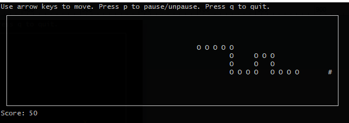
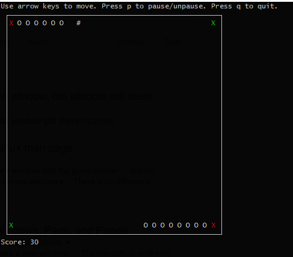
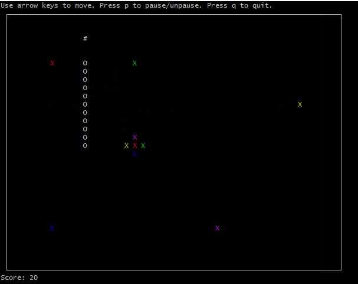
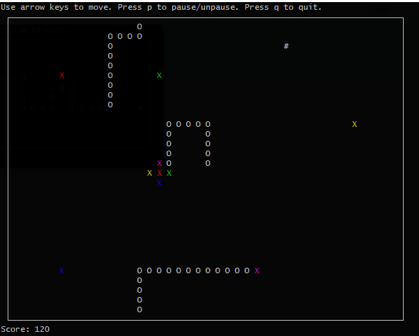

# Portal Snake
A C++ snake game implemented using the ncurses library and multiple threads, as well as portals to add a new level of fun and complexity. Features fully customizable game board width and height, snake starting length, speed, and enlargement factor, and, finally, screen refresh rate. The location and number of portals is also customizeable. 

Here are some screenshots of the game in action, with differing options:

A few portals:

Lots of portals:

Going through the portals and the border:

